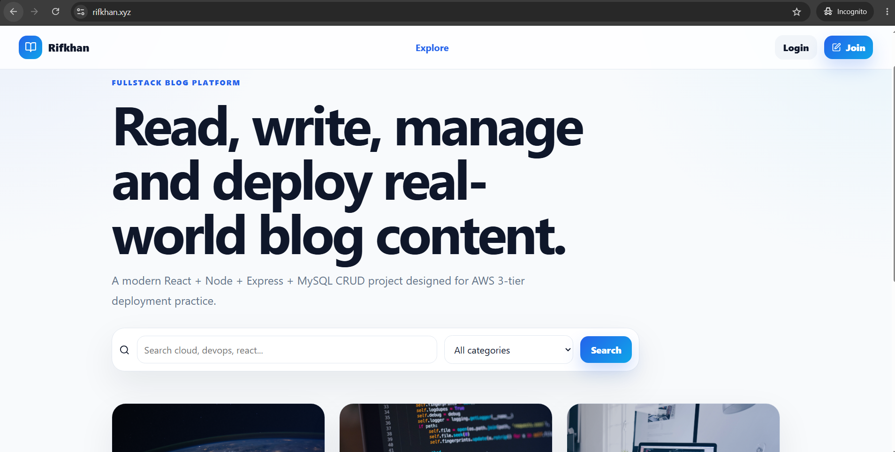
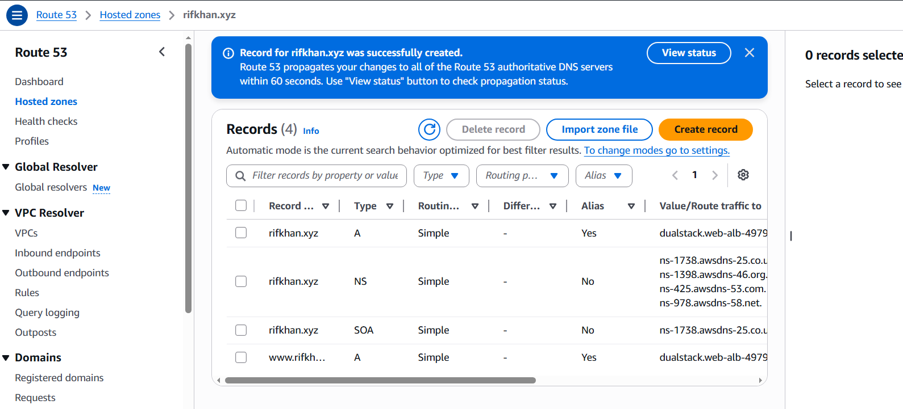
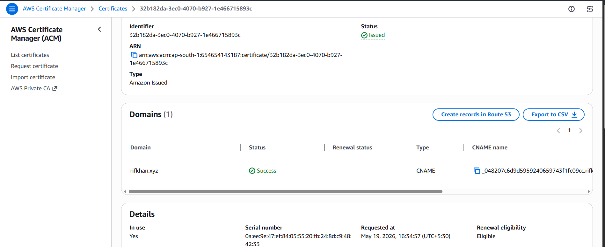
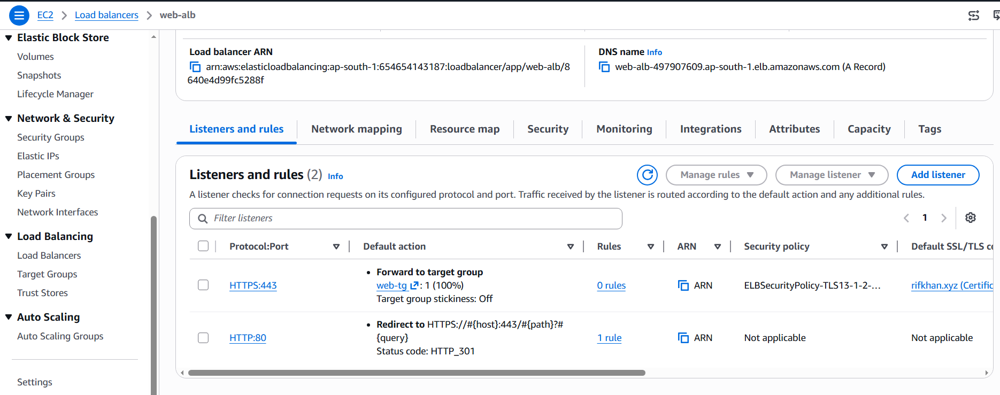
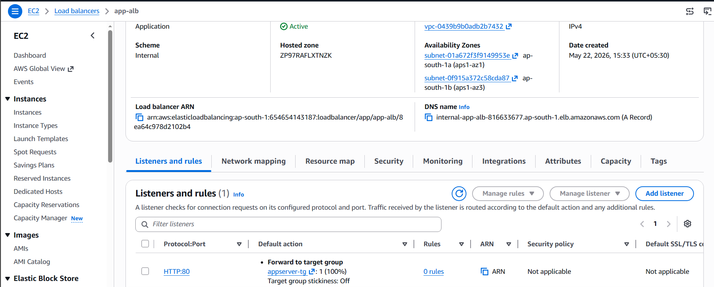
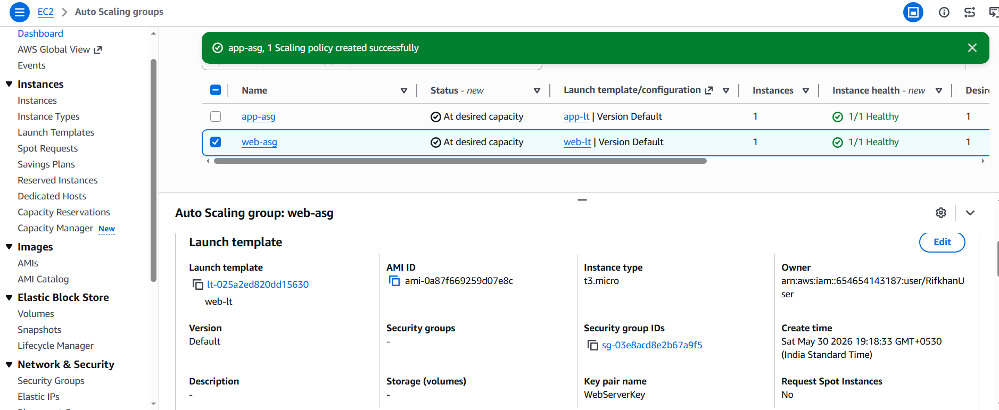
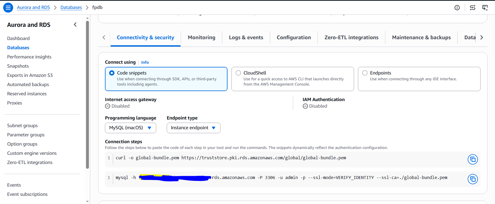

# Production-Style AWS 3-Tier Blog Application with CI/CD

A fullstack **Blog application** deployed on AWS using a production-style **3-tier architecture** with HTTPS, Route 53, Application Load Balancers, Auto Scaling Groups, private RDS MySQL, Nginx reverse proxy, PM2, and GitHub Actions CI/CD.

This project demonstrates real-world cloud deployment, infrastructure design, application hosting, security, scalability, troubleshooting, and CI/CD automation skills.

---

## Live Demo

**Application URL:** https://rifkhan.xyz

> Note: The AWS resources may be stopped or deleted later to avoid cloud cost, but the complete architecture, deployment proof, screenshots, and source code are documented in this repository.

---

## Project Overview

This is a fullstack platform with authentication, role-based access, categories, comments, and admin/author functionality.

The application was first deployed manually on AWS using a complete 3-tier architecture. After the manual deployment was completed and verified, GitHub Actions CI/CD was added to automate frontend and backend deployments using SSH.

This same project is planned to be extended into:

- Dockerized deployment with Docker, ECR, and EC2
- Serverless deployment with S3, API Gateway, Lambda, and DynamoDB
- Infrastructure as Code using Terraform

---

## Architecture Diagram


```mermaid

    User[User Browser] --> Route53[Route 53 Domain]
    Route53 --> ACM[ACM SSL Certificate]
    ACM --> PublicALB[Public Frontend ALB - HTTPS]
    PublicALB --> FrontendTG[Frontend Target Group]
    FrontendTG --> FrontendASG[Frontend Auto Scaling Group]
    FrontendASG --> Nginx[Frontend EC2 - Nginx serves React build]
    Nginx --> Proxy[Nginx Reverse Proxy /api]
    Proxy --> InternalALB[Internal Backend ALB]
    InternalALB --> BackendTG[Backend Target Group]
    BackendTG --> BackendASG[Backend Auto Scaling Group]
    BackendASG --> Express[Backend EC2 - Node.js Express with PM2]
    Express --> RDS[(Private RDS MySQL Database)]
```

---

## Application Features

- User authentication with JWT
- Blog create, read, update, and delete operations
- Categories management
- Comments system
- Admin and author roles
- Protected API routes
- React + Vite frontend
- Node.js + Express backend
- MySQL relational database
- Production deployment on AWS
- HTTPS enabled with ACM
- Custom domain using Route 53
- CI/CD using GitHub Actions

---

## Tech Stack

### Frontend

- React
- Vite
- JavaScript
- Axios
- Nginx for production serving

### Backend

- Node.js
- Express.js
- JWT Authentication
- REST API
- PM2 process manager

### Database

- MySQL
- Amazon RDS MySQL

### AWS Services

- VPC
- Public Subnets
- Private App Subnets
- Private DB Subnets
- Internet Gateway
- NAT Gateway
- Route Tables
- EC2
- Application Load Balancer
- Auto Scaling Group
- Launch Template
- RDS MySQL
- Route 53
- ACM SSL Certificate
- Security Groups

### DevOps / CI/CD

- Git
- GitHub
- GitHub Actions
- SSH deployment
- Nginx reverse proxy
- PM2
- Linux

---

## AWS 3-Tier Architecture

The application follows a production-style 3-tier architecture:

```text
User Browser
    ↓
Route 53 Domain
    ↓
ACM SSL Certificate
    ↓
Public Frontend Application Load Balancer
    ↓
Frontend Target Group
    ↓
Frontend Auto Scaling Group
    ↓
EC2 Instances running Nginx
    ↓
Nginx serves React build and reverse proxies /api
    ↓
Internal Backend Application Load Balancer
    ↓
Backend Target Group
    ↓
Backend Auto Scaling Group
    ↓
EC2 Instances running Node.js with PM2
    ↓
Private RDS MySQL Database
```

---

## AWS Resources Created

---

| Layer                                                                               | AWS Resource                                                  |
| ----------------------------------------------------------------------------------- | ------------------------------------------------------------- |
| Networking                                                                          | VPC, public subnets, private app subnets, private DB subnets  |
| Internet Access                                                                     | Internet Gateway, NAT Gateway                                 |
| Frontend                                                                            | Public ALB, frontend target group, frontend ASG, frontend EC2 |
| Backend                                                                             | Internal ALB, backend target group, backend ASG, backend EC2  |
| Database                                                                            | Amazon RDS MySQL                                              |
| Domain                                                                              | Route 53                                                      |
| SSL                                                                                 | ACM certificate                                               |
| Security                                                                            | Security groups, private database access                      |
| CI/CD                                                                               | GitHub Actions with SSH deployment                            |
| ----------------------------------------------------------------------------------- |

---

## CI/CD Pipeline

GitHub Actions was used for automated deployment because AWS CodeDeploy was not available on the current AWS account.

### Frontend CI/CD Flow

```text
Developer pushes frontend code
    ↓
GitHub Actions starts
    ↓
Install dependencies
    ↓
Build React app using VITE_API_URL=/api
    ↓
Upload dist files to frontend EC2 using SCP
    ↓
Copy files to /usr/share/nginx/html
    ↓
Reload Nginx
    ↓
Validate frontend health endpoint
```

### Backend CI/CD Flow

```text
Developer pushes backend code
    ↓
GitHub Actions starts
    ↓
SSH into frontend EC2 jump host
    ↓
SSH into private backend EC2
    ↓
Upload backend source code
    ↓
Install production dependencies
    ↓
Restart backend using PM2
    ↓
Validate backend health endpoint
```

---

## Important Production Fixes Implemented

### 1. Frontend API Routing Fix

The React frontend uses:

```env
VITE_API_URL=/api
```

This prevents the browser from directly calling the private internal backend ALB.

Correct browser API call:

```text
https://rifkhan.xyz/api/auth/login
```

Incorrect approach that was fixed:

```text
Browser calling internal backend ALB directly
```

The internal backend ALB is private and should only be accessed inside the VPC.

---

### 2. Nginx Reverse Proxy

Nginx serves the React frontend and forwards API requests to the internal backend ALB.

Example:

```nginx
location /api/ {
    proxy_pass http://internal-app-alb-1810813233.ap-south-1.elb.amazonaws.com/api/;
}
```

This allows the browser to use one clean public domain:

```text
Frontend: https://rifkhan.xyz
Backend API: https://rifkhan.xyz/api
```

---

### 3. Nginx Server Block Conflict Solved

There was a conflicting default server block in:

```text
/etc/nginx/nginx.conf
```

The default server block was removed/commented, and the project uses only:

```text
/etc/nginx/conf.d/frontend.conf
```

Verified using:

```bash
sudo nginx -t
sudo systemctl reload nginx
```

---

## Security Design

Security was designed using a layered approach.

| Component       | Security Approach                                               |
| --------------- | --------------------------------------------------------------- |
| Frontend ALB    | Public HTTPS access                                             |
| Frontend EC2    | Receives traffic through frontend ALB                           |
| Backend ALB     | Internal only                                                   |
| Backend EC2     | Private subnet, no direct public access                         |
| RDS MySQL       | Private DB subnet                                               |
| Database access | Only backend security group allowed                             |
| API access      | Browser uses `/api` through Nginx reverse proxy                 |
| SSL             | ACM certificate with HTTPS                                      |
| Secrets         | Environment variables stored on server, not committed to GitHub |

---

## Scalability and High Availability

This project includes production-level scalability components:

- Frontend Auto Scaling Group
- Backend Auto Scaling Group
- Public Application Load Balancer
- Internal Application Load Balancer
- Multi-subnet architecture
- Private application and database layers
- Health checks for frontend and backend target groups
- Nginx for frontend serving and reverse proxy
- PM2 for backend process management

---

## Screenshots / Proof

Create this folder in the repository:

```text
docs/images/
```

Add screenshots with these names:

```text
docs/images/live-app-home.png
docs/images/login-page.png
docs/images/route53-domain.png
docs/images/acm-certificate.png
docs/images/frontend-alb.png
docs/images/backend-internal-alb.png
docs/images/frontend-asg.png
docs/images/backend-asg.png
docs/images/rds-mysql.png
docs/images/github-actions-frontend-success.png
docs/images/github-actions-backend-success.png
docs/images/pm2-backend.png
docs/images/nginx-config.png
```

### Live Application



### Login Page


### Route 53 Domain



### ACM SSL Certificate



### Frontend Public ALB



### Backend Internal ALB



### Frontend Auto Scaling Group



### Backend Auto Scaling Group


### RDS MySQL



### GitHub Actions Frontend Deployment


### GitHub Actions Backend Deployment


### PM2 Backend Process


### Nginx Reverse Proxy Configuration


---

## Health Checks

Frontend health endpoint:

```text
https://rifkhan.xyz/health.html
```

Backend health endpoint through public domain:

```text
https://rifkhan.xyz/api/health
```

Backend local health endpoint:

```text
http://localhost:5000/api/health
```

---

## Deployment Branches

| Branch           | Purpose                              |
| ---------------- | ------------------------------------ |
| main             | Main application source code         |
| aws-3tier-manual | AWS 3-tier deployment and CI/CD work |

---

## Challenges Solved

### 1. Browser Could Not Access Internal Backend ALB

Problem:

```text
ERR_CONNECTION_TIMED_OUT
```

Reason:

The React frontend was built using the internal backend ALB DNS. Since the internal ALB is private, the browser could not access it.

Solution:

Used:

```env
VITE_API_URL=/api
```

Then Nginx reverse proxy forwards `/api` requests to the internal backend ALB.

---

### 2. Nginx Default Server Conflict

Problem:

Nginx had a conflicting default server block.

Solution:

Removed/commented the default server block and used only:

```text
/etc/nginx/conf.d/blog-frontend.conf
```

Verified using:

```bash
sudo nginx -t
sudo systemctl reload nginx
```

---

### 3. Backend Private Subnet Deployment

Problem:

Backend EC2 instances are in private subnets, so GitHub Actions cannot SSH directly into them.

Solution:

Used the frontend EC2 instance as a jump host.

```text
GitHub Actions
    ↓
Frontend EC2 public instance
    ↓
Backend EC2 private instance
```

---

### 4. CodeDeploy Not Available

Problem:

AWS CodeDeploy could not be used because the AWS account/card was not fully registered.

Solution:

Implemented CI/CD using GitHub Actions with SSH and SCP deployment.

---

## Future Improvements

This project will be improved further with:

- Dockerized deployment
- Docker image build and push to Amazon ECR
- EC2 deployment using Docker Compose
- Serverless frontend deployment using S3
- Serverless backend using API Gateway and Lambda
- DynamoDB version
- Monitoring with CloudWatch
- Terraform Infrastructure as Code

---

## Upcoming Version 2: Containerized Deployment

The next version of this same application will be containerized using Docker.

Planned architecture:

```text
Developer
    ↓
GitHub
    ↓
GitHub Actions
    ↓
Docker build
    ↓
Push images to Amazon ECR
    ↓
Deploy containers on EC2 / ECS
    ↓
Application Load Balancer
    ↓
RDS MySQL
```

Planned tools:

- Docker
- Docker Compose
- Amazon ECR
- EC2 with Docker
- GitHub Actions

---

## Upcoming Version 3: Serverless Deployment

A serverless version of this project is also planned.

Planned architecture:

```text
User Browser
    ↓
Route 53
    ↓
S3 Static Website / CloudFront
    ↓
API Gateway
    ↓
AWS Lambda
    ↓
DynamoDB or RDS
```

Planned AWS services:

- Amazon S3
- CloudFront
- API Gateway
- Lambda
- DynamoDB
- Parameter Store
- IAM least privilege roles
- GitHub Actions CI/CD

---

## What I Learned

Through this project, I practiced and implemented:

- Designing AWS 3-tier architecture
- Deploying frontend and backend on separate layers
- Using public and private subnets correctly
- Configuring Route 53 custom domain
- Enabling HTTPS using ACM
- Creating public and internal ALBs
- Configuring Auto Scaling Groups
- Hosting React production build with Nginx
- Reverse proxying API requests through Nginx
- Running Node.js backend using PM2
- Connecting backend to private RDS MySQL
- Debugging ALB, Nginx, API, and security group issues
- Creating GitHub Actions CI/CD pipelines
- Deploying to private EC2 through a jump host
- Understanding real-world production deployment flow

---

## Summary

This project proves practical experience in fullstack deployment, AWS architecture, CI/CD, Linux server management, production troubleshooting, and cloud security design.

The most important production concept implemented in this project is:

```text
The browser does not directly access the private backend.
The browser calls /api through the public frontend domain.
Nginx reverse proxies the request to the internal backend ALB.
The backend connects securely to the private RDS MySQL database.
```

---

## Author

**Mohammed Rifkhan**

AWS Certified Solutions Architect Associate  
Fullstack Developer | Cloud & DevOps Learner

This project is part of my cloud and DevOps portfolio to demonstrate practical AWS deployment, CI/CD automation, and production-style architecture skills.
